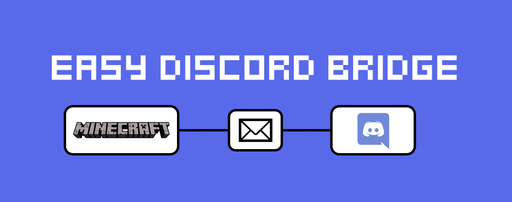

# Easy-Discord-Bridge
<p align="left">
    <!-- Java -->
    <a href="https://www.java.com" target="_blank" rel="noreferrer"> </a>
    <!-- Discord -->
    <a href="https://discord.com/" target="_blank" rel="noreferrer"> </a>
    <!-- Discord API -->
    <a href="https://github.com/DV8FromTheWorld/JDA" target="_blank" rel="noreferrer"> </a>
    <!-- Spigot -->
    <a href="https://www.spigotmc.org/" target="_blank" rel="noreferrer"> </a>
    <!-- PaperMC (Spigot fork) -->
    <a href="https://papermc.io/" target="_blank" rel="noreferrer"> </a>
    <!-- Purpur (Spigot fork) -->
    <a href="https://purpurmc.org/" target="_blank" rel="noreferrer"> </a>
</p>

EasyDiscordBridge is a plugin that allows a connection between Minecraft- and Discord chat.

- Messages sent on your discord server will be displayed in the game chat and vice versa
- Display game-server start or stop in discord chat
- Show in-game events on your discord server, like player join and quits or player deaths

This plugin was made for Spigot 1.17+. The discord functionality was made by utilizing the Java Discord API [JDA](https://github.com/DV8FromTheWorld/JDA).

### Contents
- [Setup](#setup)
- [Commands](#commands)
- [Permissions](#permissions)
- [Information for Developers](#developer)

<a name="setup"></a>
# Setup
Your server needs to run bukkit or any fork of bukkit (spigot, paper, sponge, etc.) for Minecraft 1.17+.

### Step 1: Setting up a discord bot
To use this plugin you need to set up a discord bot:
1. Navigate to https://discord.com/developers/applications and create a new application. You can choose whatever name 
fits your need.
2. In your new application, navigate to the section `Bot` and create a bot. You can choose whatever name fits your need. This
name will be the default display name of the bot on your discord server.
3. In your bots settings you will find the `token`. Save it for later steps. This token is important. Keep it always a 
secret!
4. In your application in the section `OAuth2` you will find your `client ID`. With that ID you can invite your new bot to 
your discord server. To do so, navigate to `discordapp.com/oauth2/authorize?client_id=XXXXXXX&scope=bot` but replace 
the "XXXXXXX" with your client ID.
5. After inviting the bot, he will appear in the user list of your server. Yet he will be marked as "offline" but that
will change as soon as you finished the setup.

### Step 2: Preparing your discord server
On your discord server, you need to decide which text channel you want the bot to send messages to, and which text 
you want to bot to read messages from (to print them to the minecraft chat). This can be the same channel. 

Right-click your chosen text channel(s) and select the option that lets you copy the ID. Write your wanted ID(s) down 
for later.

Important: Make sure your discord bot has permission to see that specific channel(s) and permissions to send
messages to them! If the bot appears in the user list of that channel, it probably is all set up correctly.

### Step 3: Setting up the plugin
After creating your discord bot, you can now set up the plugin. Simply drop it in your plugin folder and restart 
the server. But attention: The bot will not work just yet!

After you restarted the server, you will find a new folder in your server's plugin folder, named like this plugin. 
Navigate into that folder and open the `config.yml` file inside with a text editor of your choice.

Inside the config lookout for the following parts:
- `clientID` -> Replace the "0" with your client-ID
- `textChannelRead` -> Replace the "0" with the ID of the channel you want the bot to read messages from
- `textChannelWrite` -> Replace the "0" with the ID of the channel you want the bot to send messages to

Save your changes in the config file and restart your server again. It should all be set up and working now!

### Removing the bot and plugin
If you want to remove the plugin and the discord bot, simply remove the plugin from your server (the server must be 
turned off for this) and kick the bot from your discord server.

<a name="commands"></a>
# Commands

### Discord Link
- When enabled, the player can issue this command in-game to display a clickable link to a discord server in chat.
- This command can be used in-game.
```
/discord
```

<a name="permissions"></a>
# Permissions

| Permission | Default | Description |
| ---------- | ------- | ----------- |
| `discordbridge.getlink` | `true` | Permission to use the `/discord` command to show a clickable link |

<a name="developer"></a>
# Information for Developers
You need to use the shaded plugin.jar for it to be able to run.
