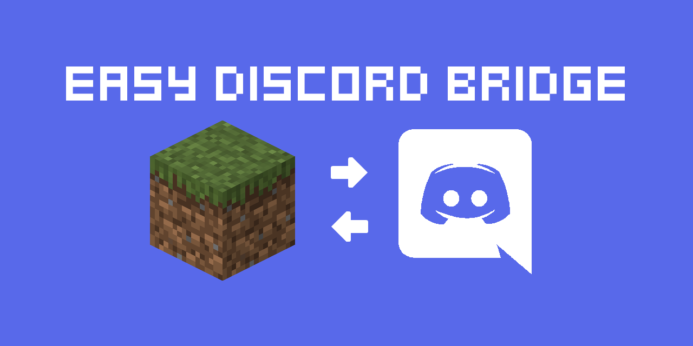

    <!-- Java -->
    
    <!-- Spigot -->
    

# EasyDiscordBridge
EasyDiscordBridge is bukkit plugin that allows a connection between Minecraft- and Discord chat.

This is a plugin for bukkit 1.17+.

### Contents
- [Overview](#overview)
- [Setup](#setup)

# Overview
This plugin aims to create an easy connection between your in-game and discord chat! The focus is on the basic 
functionalities and a simple setup.

- Messages sent on your discord server will be displayed in the game chat and vise versa.
- Show in-game events on your discord server, like game-server start/ stop, player join/ quit, player deaths

NOTE: This plugin is in a very early stage of development and not been excessively tested yet.

The discord functionality of this plugin was made with JDA (Java Discord API) 
(https://github.com/DV8FromTheWorld/JDA)

# Setup
To set the plugin and bot up, some simple steps are necessary.

### Dependencies
Your server needs to run bukkit or any fork of bukkit (spigot, paper, sponge, etc.) for minecraft 1.17+.

### Set up a discord bot
To use this plugin you need to set up a discord bot. The process is very simple:
- Navigate to https://discord.com/developers/applications and create a new application. You can choose whatever name 
fits your need.
- In your new application, go to `Settings -> Bot` and create a bot. You can choose whatever name fits your need.
- In your bots settings you will find the `token`. Save it for later steps. This token is important. Keep it always a 
secret!
- In your application under `Settings -> OAuth2` find your `client ID`. With that ID you can invite your new bot to 
your discord server. To do so, navigate to `discordapp.com/oauth2/authorize?client_id=XXXXXXX&scope=bot` but replace 
the "XXXXXXX" with your client ID.

### Prepare your discord server
- In your discord server you need to choose which text channel the bot will send messages to and which text channel the 
bot will read messages from. This can be the same channel. To do so right-click your text channel and select the 
option to copy the ID. Write your wanted ID(s) down for later.

### Set up the plugin
- After creating your discord bot, you can now set up the plugin. Simply drop it in your plugin folder and restart 
the server. ATTENTION: The bot will not work just yet!
- After the server has restarted, you will find a new folder in your servers plugin-folder, named like the plugin. 
Open the `config.yml` file inside that folder with a text editor of your choice.
- Inside the config lookout for the following parts:
  - `clientID` -> Replace the "0" with your client-ID
  - `textChannelRead` -> Replace the "0" with the ID of the channel you want the bot to read messages from
  - `textChannelWrite` -> Replace the "0" with the ID of the channel you want the bot to send messages to
- Save your changes in the config and restart your server again. It should all be set up and working now!

### Removing the bot and plugin
- If you want to remove the plugin and the discord bot, simply remove the plugin from your server (server must be 
turned off for this) and kick the bot from your discord server.

